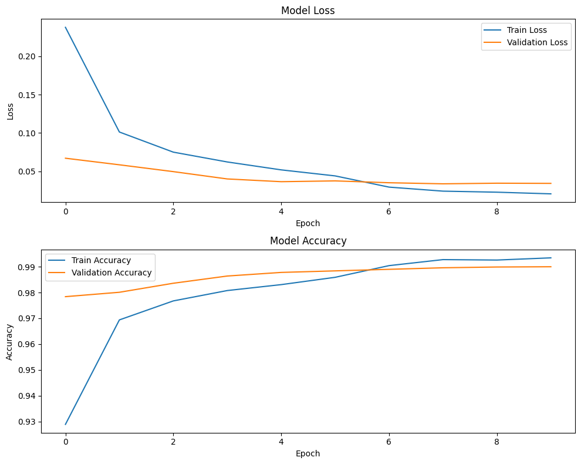

# Handwritten Digit Recognition

# Table of Contents

1. [Introduction](#introduction)
2. [Sample Images](#sample-images)
3. [Technologies Used](#technologies-used)
4. [Model Structure](#model-structure)
5. [Installation](#installation)
    - [Clone the Repository](#clone-the-repository)
    - [Install Dependencies](#install-dependencies)
    - [Run the Application](#run-the-application)
    - [Access the Application](#access-the-application)
6. [Dataset](#dataset)
7. [Results](#results)

## Introduction

This project is a simple web application for recognizing handwritten digits using a neural network model trained on the MNIST dataset. The application allows users to draw images of digits, and the model predicts which digit is in the image.

## Sample image


## Technologies Used

- **TensorFlow**: For designing and training the neural network model.
- **Flask**: For creating the web application.

## Model Structure

The neural network model has the following architecture:

```
┏━━━━━━━━━━━━━━━━━━━━━━━━━━━━━━━━━━━━━━┳━━━━━━━━━━━━━━━━━━━━━━━━━━━━━┳━━━━━━━━━━━━━━━━━┓
┃ Layer (type)                         ┃ Output Shape                ┃         Param # ┃
┡━━━━━━━━━━━━━━━━━━━━━━━━━━━━━━━━━━━━━━╇━━━━━━━━━━━━━━━━━━━━━━━━━━━━━╇━━━━━━━━━━━━━━━━━┩
│ conv2D (Conv2D)                      │ (None, 26, 26, 32)          │             320 │
├──────────────────────────────────────┼─────────────────────────────┼─────────────────┤
│ max_pooling (MaxPooling2D)           │ (None, 13, 13, 32)          │               0 │
├──────────────────────────────────────┼─────────────────────────────┼─────────────────┤
│ flatten (Flatten)                    │ (None, 5408)                │               0 │
├──────────────────────────────────────┼─────────────────────────────┼─────────────────┤
│ dense (Dense)                        │ (None, 128)                 │         692,352 │
├──────────────────────────────────────┼─────────────────────────────┼─────────────────┤
│ dropout (Dropout)                    │ (None, 128)                 │               0 │
├──────────────────────────────────────┼─────────────────────────────┼─────────────────┤
│ output (Dense)                       │ (None, 10)                  │           1,290 │
└──────────────────────────────────────┴─────────────────────────────┴─────────────────┘
```

## Installation

To run this project locally, follow these steps:

1. **Clone the repository:**

    ```bash
    git clone https://github.com/hopedeveloper0/handwritten_digit_recognition.git
    cd handwritten-digit-recognition
    ```

2. **Install the required dependencies:**

    ```bash
    pip install -r requirements.txt
    ```

3. **Run the application:**

    ```bash
    python app.py
    ```

4. **Access the application:**

   Open your web browser and go to `http://127.0.0.1:5000/`.

## Dataset

The model is trained on the [MNIST dataset](http://yann.lecun.com/exdb/mnist/), which consists of 60,000 training images and 10,000 test images of handwritten digits from 0 to 9.

## Results

The model has been trained and tested with a final accuracy of **98.7%** on the test set of 10,000 images.



---

#  Telegram Bot

This project is a Telegram bot that uses a deep learning model to recognize handwritten digits in images. The bot leverages a trained TensorFlow model to predict the number shown in a handwritten image.

## Features

- Recognizes handwritten digits (0 to 9) from images sent to the bot
- Uses an advanced deep learning model for accurate digit recognition
- Fast and easy to use

## Setup Instructions

To use the bot, follow these steps:

### Installation Steps

1. Clone the project from GitHub:

   ```bash
   git clone https://github.com/hopedeveloper0/handwritten_digit_recognition.git
   ```

2. Navigate to the project directory:

   ```bash
   cd handwritten_digit_recognition/
   ```

3. Install the required libraries:

   ```bash
   pip install -r requirements.txt
   ```

4. Enter your Telegram bot token in the `get_token.py` file. You can get your token from [BotFather](https://core.telegram.org/bots#botfather).

   ```python
   TOKEN = 'your-telegram-bot-token'
   ```

5. Place the trained model (best performing model) in the path `handwritten_digit_recognition/best_model.keras`.

### Running the Bot

1. After completing the above steps, run the bot with:

   ```bash
   python app.py
   ```

2. Now you can interact with the bot on Telegram. Simply send an image of a handwritten digit on a white background, and the bot will send back the recognized digit.

### How It Works

- When you send the `/start` command, the bot will send a welcome message and ask you to upload an image of a handwritten digit.
- Upon receiving the image, the bot processes the image and sends back the predicted digit.

## Project Structure

```
telegram_bot/
│
├── app.py                     # Main Telegram bot code
├── get_token.py               # Telegram bot token
├── best_model.keras           # Trained model for handwritten digit recognition
```
